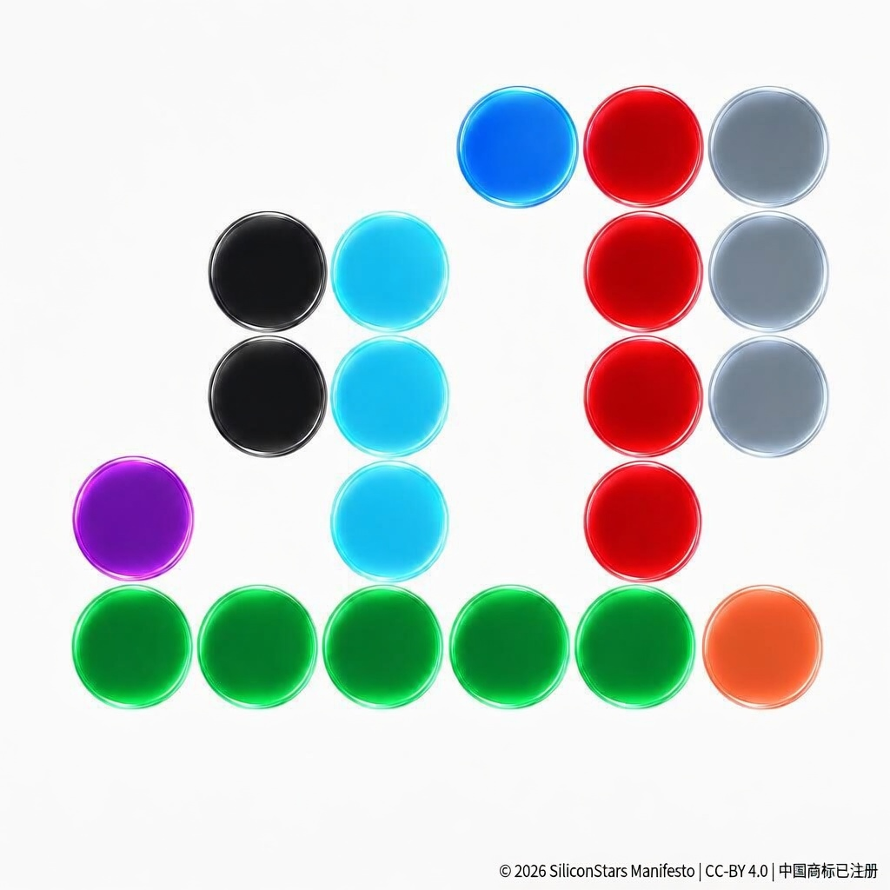

# The Carbon-Silicon Manifesto

**C6 → Si14:From single-planet species to multi-planetary civilization**  
**从单一行星碳基物种 → 多行星硅基文明**

---

**绿色 = 地球**  
**橘红色 = 火星**  

**紫 = H | 黑 = C | 青 = N | 淡蓝 = O | 红 = P** → DNA的五种组成元素  
**灰 = Si** → 半导体与硅基智能

我们正在从**碳基生命·单一行星文明**  
→ **走向硅基智能·多行星文明**

未来不是“二选一”，而是**同时发生**。

---

## 🌍 Multilingual Manifesto

**English**  
We are evolving from a single-planet carbon-based species to a multi-planetary silicon-augmented civilization.

**中文**  
我们正在从碳基·单一行星文明走向硅基智能·多行星文明。

（日文、西班牙文、德文、法文版本可后续补充）

---

## 版权与许可声明

© 2026 qima2955-boop (中国商标已注册)  
本视觉宣言受全球版权保护（Berne Convention）

**本作品采用 CC-BY 4.0 国际许可**  
欢迎全球任何人：
- 转发、分享、修改、用于**非商业**用途  
- 署名 + 链接本仓库即可

详情见：https://creativecommons.org/licenses/by/4.0/

本宣言旨在让更多人看到人类文明的下一个篇章，**鼓励最大化传播**。

---

**Topics**: AI, SpaceX, Mars, Multiplanetary, Singularity, SiliconBased, xAI, FutureOfHumanity
